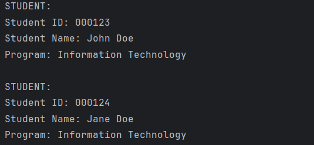
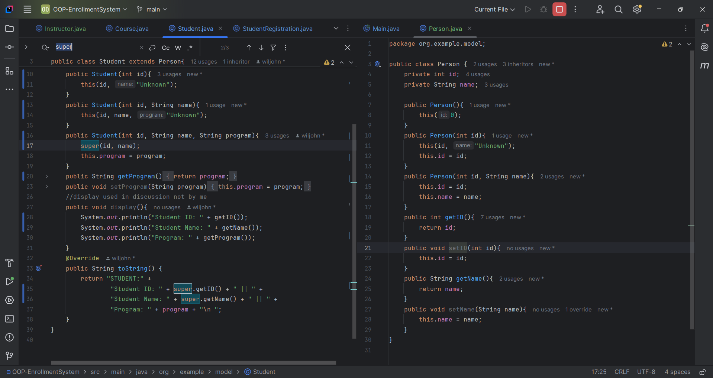
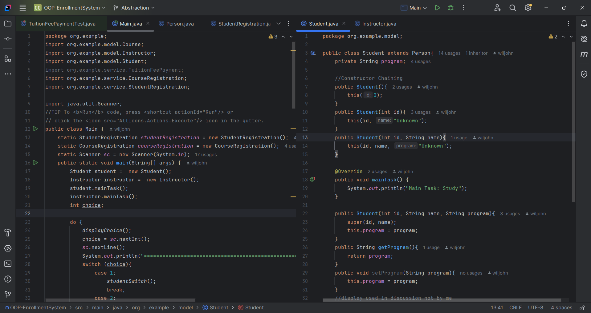
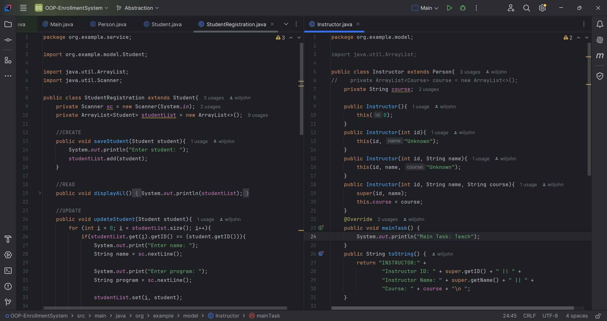

# Enrollment System

---
**Author: Wiljohn Lingao**

**1. Description**
- Simple enrollment system for OOP practice.
- Implemented Abstraction in the OOP Enrollment System.

# Inheritance

# Abstraction
---
**Main and Student Classes**

===
**Instructor and Person Classes**

===
