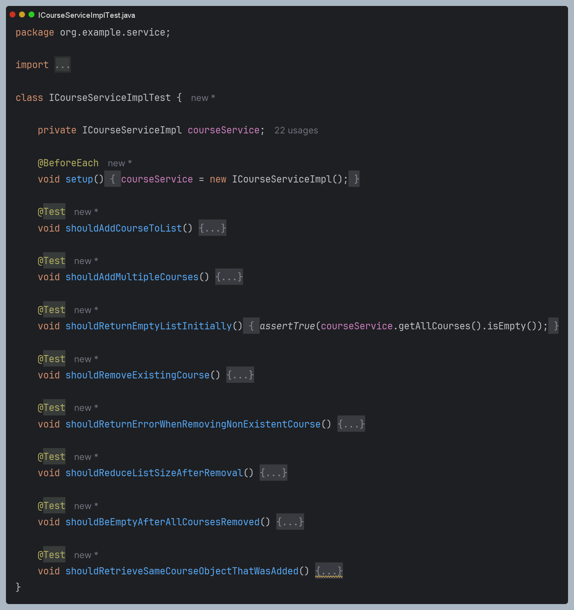
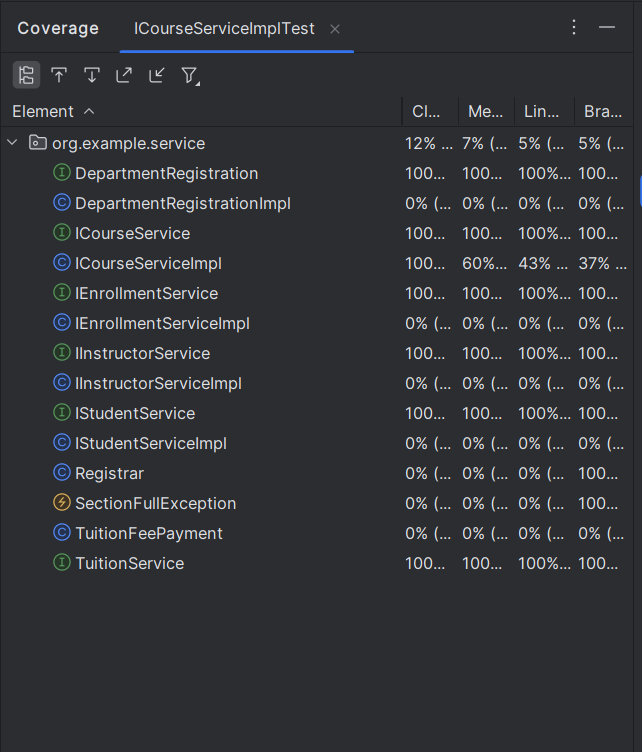
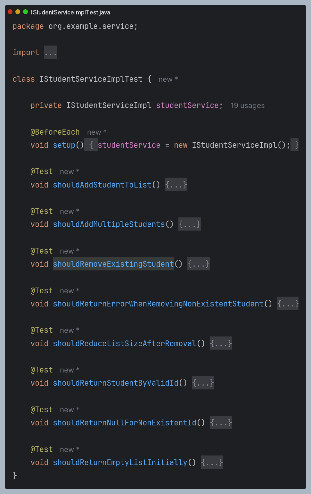
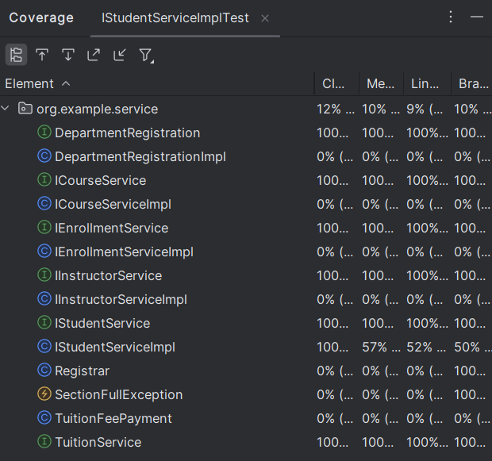
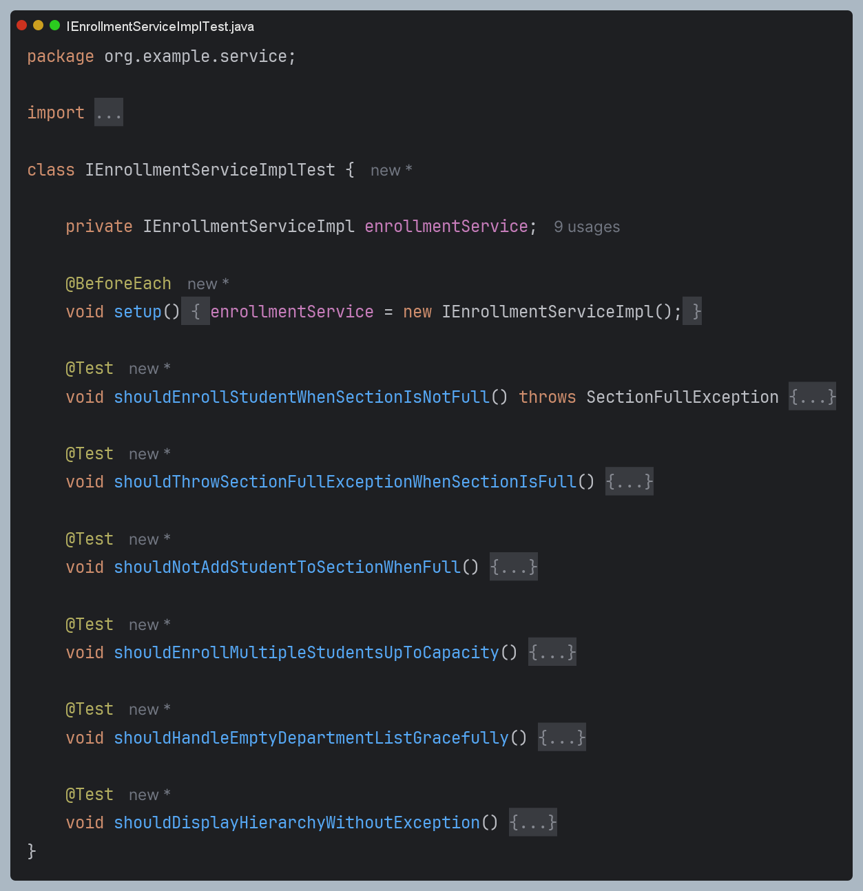
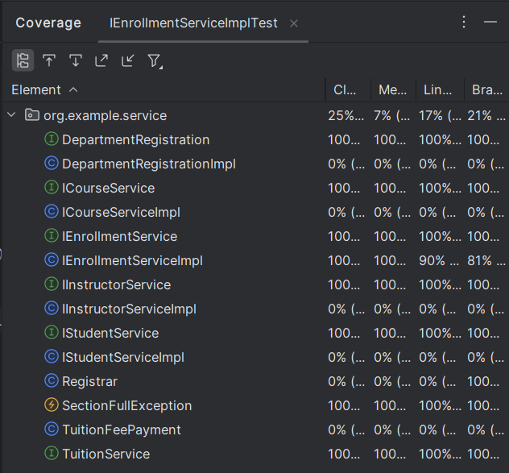
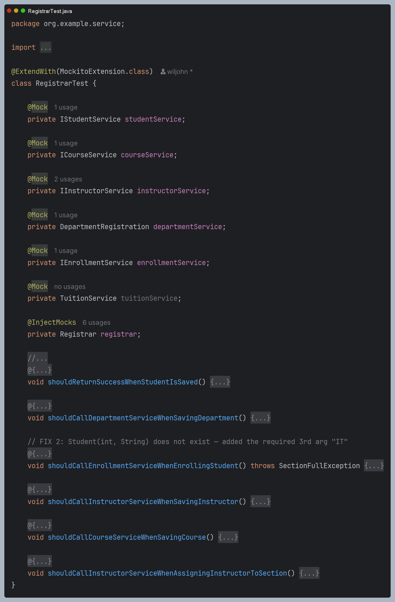
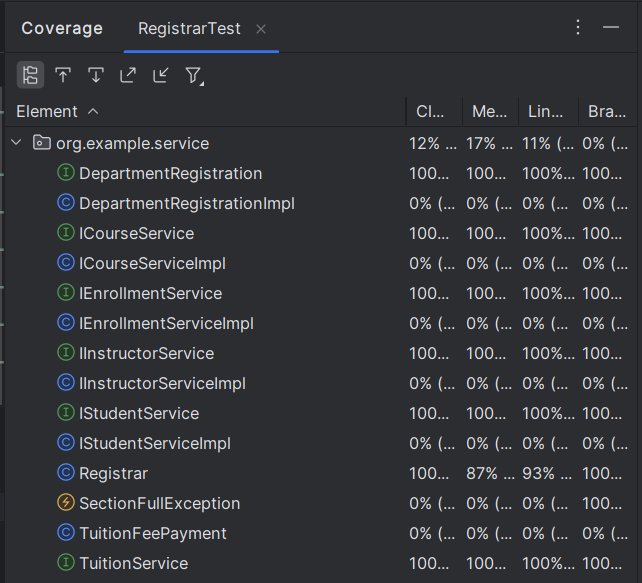
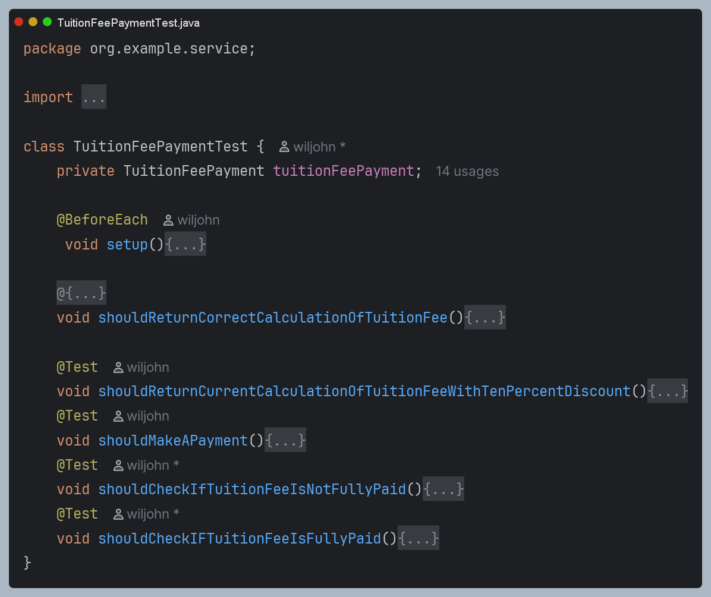
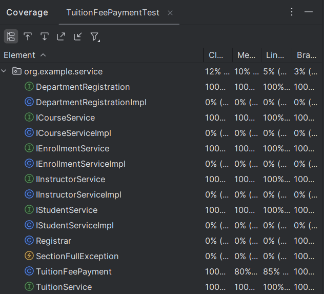

# Enrollment System

---
**Author: Wiljohn Lingao**

## 1. Description
- Simple enrollment system for OOP practice.
- Implements access modifiers, OOP, JUnit, Mockito, etc. 

# Inheritance

# Abstraction

## Main and Student Classes

## Instructor and Person Classes

# Testing

## Course

### Coverage

---

## Student

### Coverage

---

## Enrollment

### Coverage

---

## Registrar

### Coverage

---

## Tuition Fee Payment

### Coverage

---
